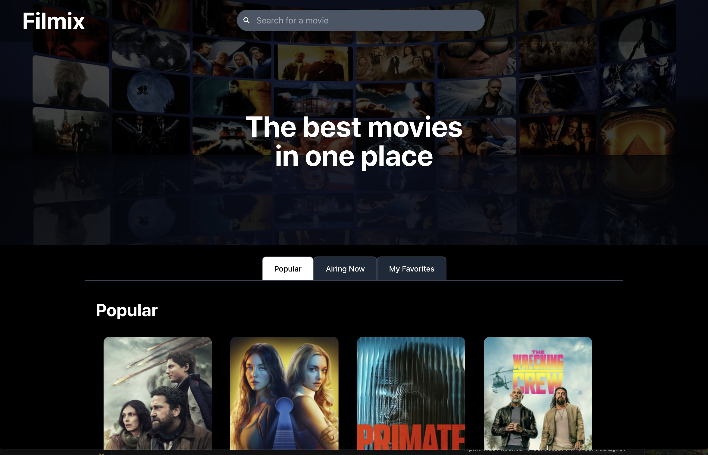

# Filmix

Movie app that lists movies from TMDB, supports search, favorites (stored in Redux + localStorage), and movie detail page.

**Live:** [filmix-tau.vercel.app](https://filmix-tau.vercel.app/)



## Tech stack

- **React**
- **Vite**
- **React Router**
- **Redux (Toolkit)**
- **Redux Saga**
- **Tailwind CSS**
- **Motion**
- **Vitest + Testing Library**

## Keyboard navigation

- `/` search
- `m` categories, `f` films , `p` pagination
- `Arrow` keys move focus/navigation
- `Enter` open/select
- `Esc` close/go back
- `Tab` disabled

Movies data comes from [TMDB](https://www.themoviedb.org/). Create a `.env` file and add your API token: `VITE_API_ACCESS_TOKEN=your_bearer_token`.

## Run

```bash
npm install
npm run dev
```

Tests: `npm run test`
